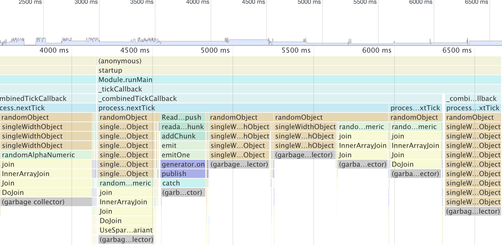

# Memory Leaks Testing for `amqp-connection-manager`

This is an example of fast messages producer to illustrate performance issues with [amqp-connection-manager](https://github.com/benbria/node-amqp-connection-manager).

## Running

Start local RabbitMQ server or modify [config.js](config.js) to point to a remote one.

Run either [amqplib.js](amqplib.js) or [amqp-conn-manager](amqp-conn-manager.js), preferably with limited memory to see memory leak sooner:

[amqplib](https://github.com/squaremo/amqp.node) implementation:

```
node --max_old_space_size=60 amqplib.js
```

[amqp-connection-manager](https://github.com/benbria/node-amqp-connection-manager) implementation

```
node --max_old_space_size=60 amqp-conn-manager.js
```

## Results

Running `amqplib` implementation correctly sends all messages, with proper backpressure and socket draining:

```
$ time node --max_old_space_size=60 amqplib.js
...snip..
99995
99996
99997
99998
99999
100000
100001
^C
node --max_old_space_size=60 amqplib.js  96,59s user 5,64s system 35% cpu 4:47,43 total
```

Running `amqp-connection-manager` crashes after ~600 messages because it runs out of memory:

```
$ time node --max_old_space_size=60 amqp-conn-manager.js
...snip...
633
634

<--- Last few GCs --->

[34725:0x102001000]     4762 ms: Mark-sweep 63.8 (68.8) -> 63.8 (68.8) MB, 41.7 / 0.0 ms  (+ 0.0 ms in 0 steps since start of marking, biggest step 0.0 ms, walltime since start of marking 49 ms) last resort GC in old space requested
[34725:0x102001000]     4810 ms: Mark-sweep 63.8 (68.8) -> 63.8 (68.8) MB, 48.6 / 0.0 ms  last resort GC in old space requested


<--- JS stacktrace --->

==== JS stack trace =========================================

...snip...

FATAL ERROR: CALL_AND_RETRY_LAST Allocation failed - JavaScript heap out of memory
 1: node::Abort() [/usr/local/opt/node@8/bin/node]
 2: node::FatalException(v8::Isolate*, v8::Local<v8::Value>, v8::Local<v8::Message>) [/usr/local/opt/node@8/bin/node]
 3: v8::Utils::ReportOOMFailure(char const*, bool) [/usr/local/opt/node@8/bin/node]
 4: v8::internal::V8::FatalProcessOutOfMemory(char const*, bool) [/usr/local/opt/node@8/bin/node]

...snip...

node --max_old_space_size=60 amqp-conn-manager.js  5,77s user 0,13s system 121% cpu 4,854 total
```

Furthermore, as internal buffer grows, more time is spent on garbage collection, which significantly slows down the event loop:



